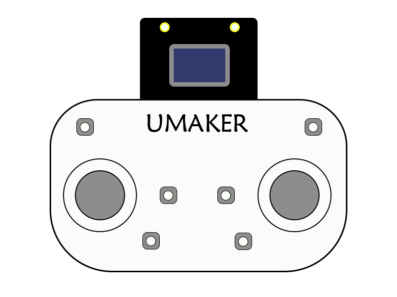
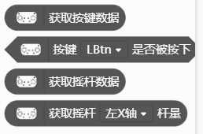
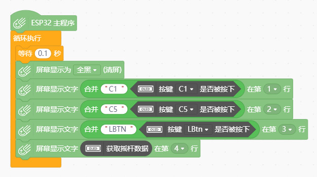

# 掌控板扩展手柄

---------------------------------------------------------

## 介绍

本品采用74HC165芯片作为8个按键C1-C8的输入处理提高了掌控板获取按键数据的稳定性，同时也避免了与板载传感器产生IO冲突的问题。如果不想购买成品也可以通过购买焊接套件的方式让学生参与制作，焊接套件只需焊接掌控板中的按键和摇杆部分即可贴片部分则提前焊接完毕。可用于掌控板的游戏编程与基于ESP-Now开发的智能小车遥控器与终端，以及作为TT无人机的可编程遥控终端使用，为掌控板扩展出更多的玩法。

## 功能介绍

本产品采用常见的MicroBit 40P接口提供稳定的连接，共引出C1-C8，Lbtn、Rbtn10个可编程按钮，以及两组XY轴摇杆，其中C1-C8连接74HC165芯片不会与板载传感器IO产生冲突，可以实现更多的功能。

## 模块介绍

## 样例程序

## 兼容列表

MCU                | JavaScript    | Arduino   | MicroPython    | Remarks
------------------ | :----------: | :----------: | :---------: | -----
掌控板        |             |       √       |             |

## 其他相关资料

[掌控版手柄原理图](./掌控板手柄原理图.pdf)  
[74HC165数据手册](./sn74hc165.pdf)  
[掌控版手柄激光切割外壳文件](./掌控版手柄激光切割外壳文件.dwg)